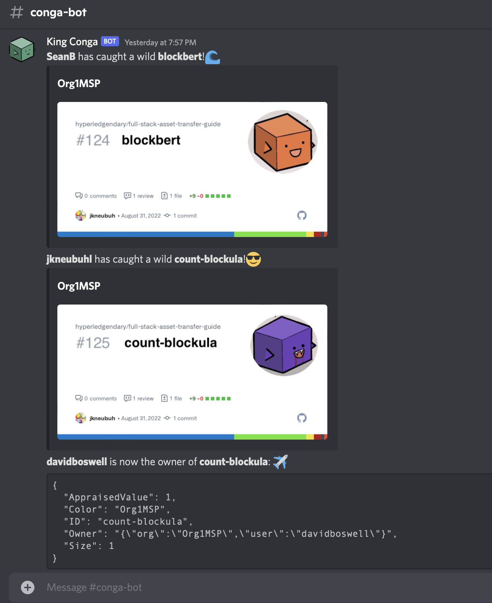

# Conga Cards

This Gateway Client application will listen for chaincode events, invoking a [#discord webhook](https://discord.com/developers/docs/resources/webhook)
to post a channel message when [Conga Cards](assets/) are created, deleted, and exchanged on a channel.

> [Conga Comics](https://congacomic.github.io) | Life on the chain, one block at a time by Ed Moffatt & some friends 

This project is based on the [trader-typescript](../trader-typescript) sample Gateway Client application. 


## Prerequisites

The client application requires Node.js 16 or later.

## Set up

The following steps prepare the client application for execution:

1. Ensure the [asset-transfer](../../contracts/asset-transfer-typescript/) smart contract is deployed to a running Fabric network.
1. Run `npm install` to download dependencies and compile the application code.

> **Note:** After making any code changes to the application, be sure to recompile the application code. This can be done by explicitly running `npm install` again, or you can leave `npm run build:watch` running in a terminal window to automatically rebuild the application on any code change.


The client application uses environment variables to supply configuration options. You must set the following environment variables when running the application:

- `ENDPOINT` - endpoint address for the Gateway service to which the client will connect in the form **hostname:port**. Depending on your environment, this can be the address of a specific peer within the user's organization, or an ingress endpoint that dispatches to any available peer in the user's organization.
- `MSP_ID` - member service provider ID for the user's organization.
- `CERTIFICATE` - PEM file containing the user's X.509 certificate.
- `PRIVATE_KEY` - PEM file containing the user's private key.

The following environment variables are optional and can be set if required by your environment:

- `CHANNEL_NAME` - Channel to which the chaincode is deployed. (Default: `mychannel`)
- `CHAINCODE_NAME` - Channel to which the chaincode is deployed. (Default: `asset-transfer`)
- `TLS_CERT` - PEM file containing the CA certificate used to authenticate the TLS connection to the Gateway peer. *Only required if using a TLS connection and a private CA.*
- `HOST_ALIAS` - the name of the Gateway peer as it appears in its TLS certificate. *Only required if the endpoint address used by the client does not match the address in the Gateway peer's TLS certificate.*

- `WEBHOOK_URL` - the [#discord webhook](https://discord.com/developers/docs/resources/webhook) to which the channel 
  events will be relayed. 


# Run

The sample application is run as a command-line application, and is lauched using `npm start <command> [<arg> ...]`. The following commands are available:

- `npm start create <assetId> <ownerName> <color>` to create a new asset.
- `npm start delete <assetId>` to delete an existing asset.
- `npm start getAllAssets` to list all assets.
- `npm start read <assetId>` to view an existing asset.
- `npm start transfer <assetId> <ownerName> <ownerMspId>` to transfer an asset to a new owner within an organization MSP ID.
- `npm start discord` starts an event loop, relaying channel events to `${WEBHOOK_URL}`


## Sample Interaction:

- Submit some transactions to a ledger:
```shell
npm start create blockbert SeanB orange

npm start create count-blockula jkneubuhl AirtelMSP purple

npm start transfer count-blockula davidboswell AirtelMSP 
```

- Run the discord event listener:
```shell
export WEBHOOK_URL="https://discord.com/api/webhooks/123456789/xyzzy-abcdef-12345"

npm start discord
```

